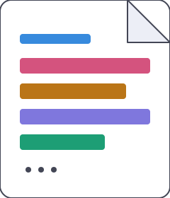

<p align="center">
  
</p>

<h1 align="center">Aduh, apa ya?</h1>
<p align="center">Klasifikasi kategori berita BBC dengan TF-IDF dan Stacking Ensemble</p>

<p align="center">
  
  
  
</p>

---

Demo interaktif yang mengklasifikasikan teks berita ke dalam lima kategori: *business*, *entertainment*, *politics*, *sport*, dan *tech*. Setiap kata dalam teks yang dimasukkan disorot dengan warna sesuai kategori yang paling diwakilinya, sehingga terlihat jelas bagian mana dari teks yang mendorong keputusan model.

Input dalam bahasa selain Inggris diterjemahkan secara otomatis sebelum diklasifikasikan, karena model dilatih pada korpus berbahasa Inggris.

## Cara kerja

Teks melalui praproses (lowercasing, penghapusan stopword, lemmatization) sebelum direpresentasikan sebagai vektor TF-IDF dengan kombinasi unigram dan bigram. Tiga model dasar, yaitu LinearSVC, Complement Naive Bayes, dan Logistic Regression, masing-masing memprediksi kategori, kemudian prediksi ketiganya digabungkan oleh sebuah meta-learner pada Stacking Classifier untuk menghasilkan prediksi akhir.

Konfigurasi tersebut dipilih melalui eksperimen sistematis pada lima varian praproses dan empat parameter TF-IDF, kemudian divalidasi melalui ablation study, hyperparameter tuning, dan analisis bias. Detail lengkap eksperimen tersedia pada notebook di folder [`notebooks/`](./notebooks) dan pada [laporan tugas besar](./docs/Laporan_TM.pdf).

| Metrik | Nilai |
|---|---|
| Akurasi validasi | 97,99% |
| Akurasi cross-validation (5-fold) | 98,07% |
| Jumlah artikel | 1.490 |
| Kategori | business, entertainment, politics, sport, tech |

## Struktur proyek

```
.
├── frontend/              Halaman statis (HTML, CSS, JS) untuk GitHub Pages
│   ├── index.html         Halaman input teks
│   ├── result.html        Halaman hasil klasifikasi dan highlight kata
│   ├── model.html         Halaman detail model dan pipeline
│   └── assets/
│       ├── css/styles.css
│       └── js/
│           ├── config.js  Alamat backend dikonfigurasi di sini
│           ├── main.js
│           ├── result.js
│           └── model.js
│
├── backend/               API FastAPI untuk inference, dideploy ke Hugging Face Spaces
│   ├── app.py             Endpoint /classify
│   ├── requirements.txt
│   ├── Dockerfile
│   └── artifacts/         Berkas model hasil training
│       ├── model.pkl
│       ├── tfidf.pkl
│       └── feature_weights.json
│
├── notebooks/
│   └── train_model.ipynb  Notebook untuk melatih ulang model dan menghasilkan artifacts
│
├── docs/
│   └── DEPLOYMENT.md      Panduan deployment frontend dan backend
│
└── assets/
    └── logo.svg
```

## Menjalankan secara lokal

Backend:

```bash
cd backend
pip install -r requirements.txt
python app.py
```

Dokumentasi API tersedia pada `http://localhost:7860/docs` setelah server berjalan.

Frontend:

```bash
cd frontend
python -m http.server 8000
```

Buka `http://localhost:8000` pada peramban. Alamat backend yang digunakan frontend diatur pada `frontend/assets/js/config.js`.

## Deployment

Frontend dideploy sebagai situs statis melalui GitHub Pages, sementara backend dideploy sebagai layanan Docker pada Hugging Face Spaces. Pemisahan ini diperlukan karena GitHub Pages hanya melayani berkas statis, sedangkan proses inference model scikit-learn membutuhkan runtime Python yang berjalan terus-menerus.

Panduan lengkap, termasuk cara menghasilkan ulang berkas model dan mengatasi masalah deployment yang umum terjadi, tersedia pada [`docs/DEPLOYMENT.md`](./docs/DEPLOYMENT.md).

## Melatih ulang model

Notebook `notebooks/train_model.ipynb` menghasilkan tiga berkas yang dibutuhkan backend: `model.pkl`, `tfidf.pkl`, dan `feature_weights.json`. Notebook ini dapat dijalankan pada Kaggle atau Google Colab tanpa konfigurasi tambahan selain path dataset. Setelah selesai, ketiga berkas dipindahkan ke `backend/artifacts/` sebelum backend dideploy ulang.

## Lisensi

MIT.

## Tim

Tugas Besar Penambangan Teks, Kelompok 8 "Aduh".

| Nama | NIM |
|---|---|
| Sarah Aisyah | 103052300022 |
| Arkhan Falih Fahrie P | 103052330051 |
| Richad Fernando | 1305223004 |

S1 Sains Data, Fakultas Informatika, Universitas Telkom, 2026.